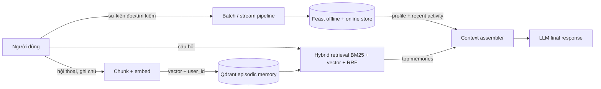

# Hybrid Memory Architecture

POC này thiết kế trợ lý cá nhân cho người dùng Việt Nam, kết hợp episodic
memory trong vector store với hồ sơ ổn định và hoạt động gần đây từ feature
store. Mục tiêu không phải gọi LLM thật mà chứng minh được ranh giới dữ liệu,
tính mới, cách ly người dùng và cách ghép context trước khi sinh câu trả lời.

## Quyết định 1 — Chunk theo đoạn, giới hạn khoảng 80 từ

POC chọn tách theo đoạn văn, sau đó cắt cứng ở 80 từ nếu đoạn quá dài. So với
per-message, cách này không làm một tin nhắn dài trở thành một vector quá rộng;
so với semantic chunking bằng model riêng, nó rẻ, xác định và chạy offline.
Tradeoff là semantic boundary đôi lúc bị cắt sai, đặc biệt khi một câu giải
thích kéo dài qua hai đoạn. Chunk nhỏ tăng retrieval precision nhưng tăng số
vector, chi phí lưu trữ và số token metadata; chunk lớn giữ ngữ cảnh tốt hơn
nhưng một hit có thể mang nhiều nội dung không liên quan vào context window.
Mức 80 từ hợp lý cho POC vì memory là ghi chú ngắn, không phải sách. Production
sẽ dùng 150–300 token, overlap khoảng 10%, lưu `conversation_id`, timestamp và
quan hệ chunk trước/sau để mở rộng context có kiểm soát.

Với tiếng Việt, whitespace split là lựa chọn có chủ ý cho demo: nhanh và không
thêm dependency. Nó yếu hơn `underthesea`/`pyvi` vì từ ghép như “điện toán đám
mây” có nhiều âm tiết. Dense embedding bù một phần, còn BM25 có thể dùng cả
unigram lẫn word-segmented token ở production. Code-switching “deploy pod lên
cloud” phải được giữ nguyên; ép dịch toàn bộ trước khi index có thể làm mất tên
sản phẩm và thuật ngữ kỹ thuật.

## Quyết định 2 — Feature tabular rõ nghĩa, không dùng embedding profile

Hồ sơ online gồm `preferred_language`, `topic_affinity`,
`reading_speed_wpm`; activity gồm `queries_last_hour`. Entity là `user_id`.
Profile có nguồn batch từ bảng tài khoản và TTL 30 ngày; query velocity đến từ
event stream và TTL một giờ. Chọn feature tabular thay vì một “user embedding”
duy nhất vì giá trị có thể giải thích, audit, sửa và dùng trực tiếp trong prompt
hoặc reranking. Embedding profile có ưu điểm học được sở thích tiềm ẩn và dễ
matching với item, nhưng khó biết vì sao đề xuất xuất hiện, khó thực thi quyền
chỉnh sửa dữ liệu và có thể trộn sở thích nhạy cảm ngoài ý muốn.

Tradeoff của tabular là schema phải tiến hoá thủ công và `topic_affinity` không
biểu diễn tốt người thích nhiều chủ đề. Bản sau có thể giữ top-N topic có trọng
số, nhưng không thay tabular bằng latent vector hoàn toàn. Feast chịu trách
nhiệm training/serving consistency và PIT join; `ProfileStore` adapter trong
POC cho phép chạy bằng Feast sau NB4, đồng thời có fallback xác định cho demo
sạch. Fallback chỉ phục vụ khả năng chạy, không được xem là online store thật.

## Quyết định 3 — Freshness theo ba nhịp khác nhau

Memory vừa được người dùng chủ động lưu phải searchable ngay: `remember()`
embed và upsert đồng bộ, mục tiêu dưới một giây. Nếu dùng batch năm phút, câu
“trợ lý nhớ gì về tôi?” ngay sau thao tác lưu sẽ tạo cảm giác mất dữ liệu. Đổi
lại, synchronous write làm request chậm và cần retry/idempotency; production
có thể ghi durable log trước rồi index async nhưng dùng read-your-writes cache.

Recent activity như `queries_last_hour` cần stream hoặc micro-batch dưới một
phút vì nó dùng cho ngữ cảnh phiên hiện tại. Chấp nhận trễ 30–60 giây để giảm
chi phí Kafka/Push API so với sub-second. Stable profile như tốc độ đọc và ngôn
ngữ ưu tiên chỉ cần batch hằng ngày vì thay đổi chậm. Ba SLA khác nhau tránh trả
giá streaming cho mọi dữ liệu, nhưng yêu cầu context assembler ghi nhận event
time và không coi feature hết TTL là giá trị hiện tại.

## Lựa chọn đã loại bỏ

Tôi đã xem xét lưu cả episodic memory dưới dạng embedding feature view trong
feature store, nhưng loại bỏ vì lifecycle khác hẳn: memory tăng sau mỗi cuộc
hội thoại, cần ANN, delete từng memory và ranking; profile có schema nhỏ, lookup
theo khóa và cần PIT correctness. Ép hai loại vào một store làm re-index và TTL
khó vận hành hơn. Qdrant giữ episode, Feast giữ state phục vụ; context assembler
là điểm join rõ ràng.

## Quyền riêng tư và giới hạn

Mọi vector mang payload `user_id` và truy vấn Qdrant luôn có filter bắt buộc.
Per-user collection cách ly mạnh hơn nhưng tạo quá nhiều collection; shared
collection tiết kiệm vận hành nhưng filter omission trở thành sự cố rò dữ liệu.
Production cần policy test, encryption at rest, audit log, consent và chức năng
xoá/export theo yêu cầu người dùng, phù hợp bối cảnh Nghị định 13 về bảo vệ dữ
liệu cá nhân tại Việt Nam.

POC chưa có durable storage, deduplication, cập nhật/xoá memory, memory decay,
multi-device sync, reranker, chống prompt injection trong memory, hay LLM tạo
đáp án. BM25 được dựng lại khi recall nên không phù hợp quy mô lớn. Nó cũng
không đo drift của profile và chưa che PII trước khi embedding. Đây là các bước
cần hoàn thiện trước khi dùng ngoài demo.
